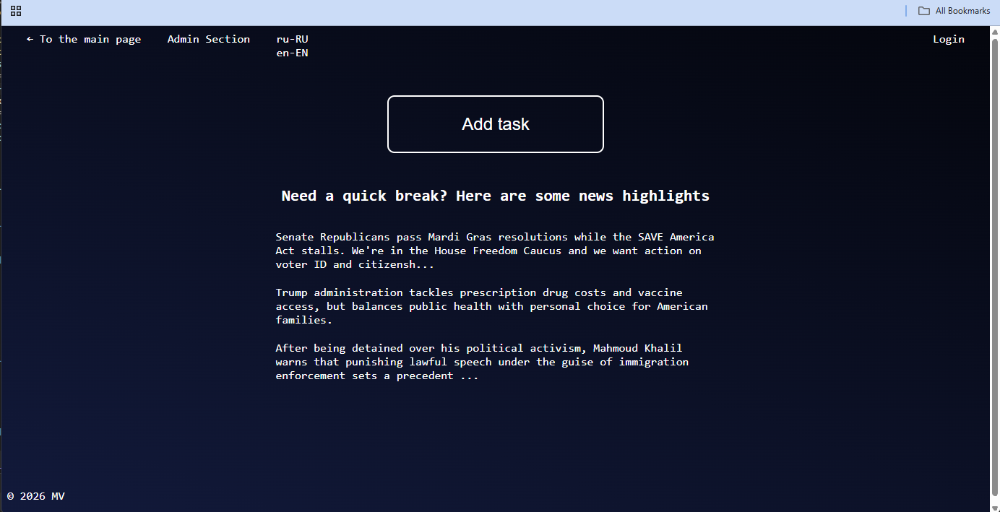
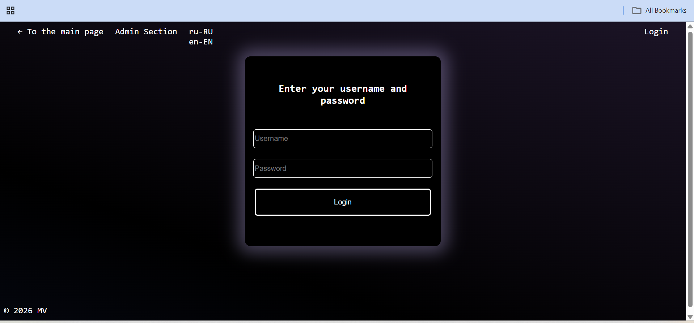
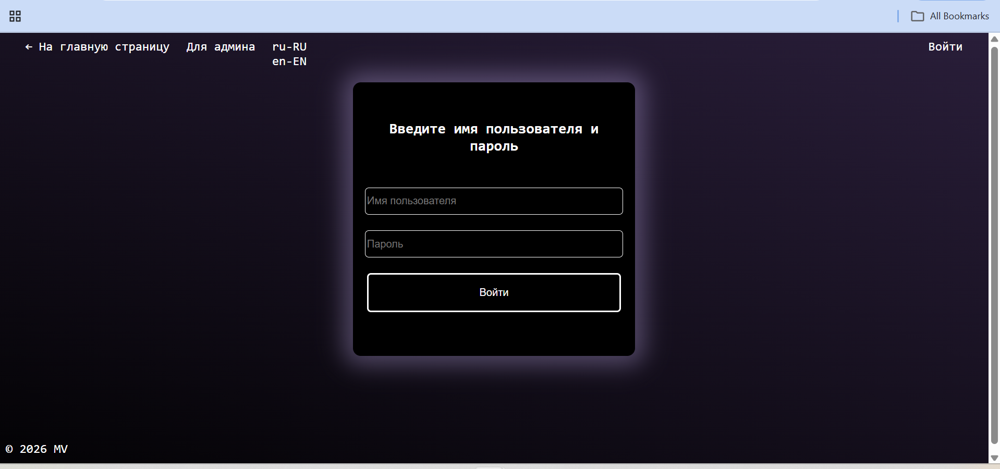
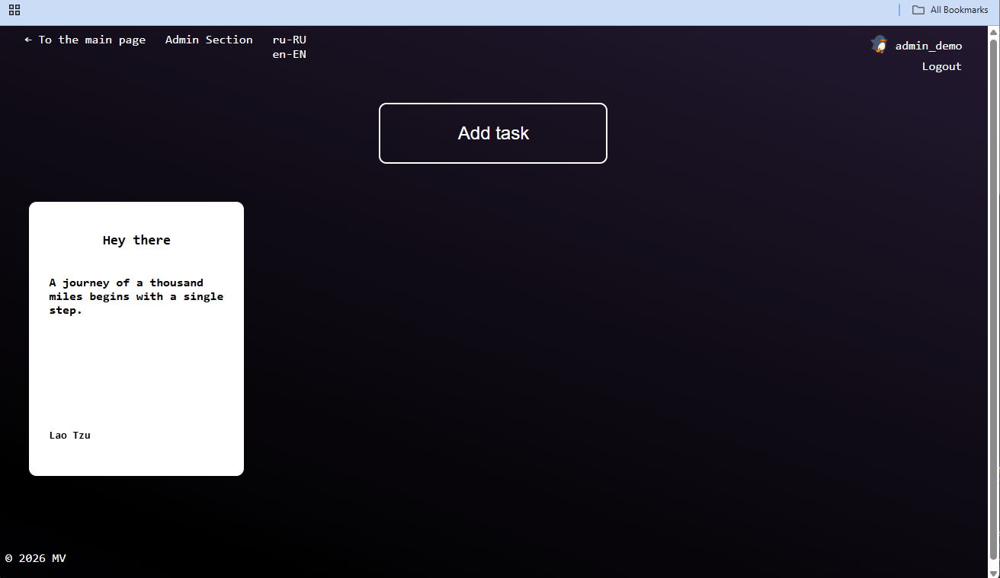
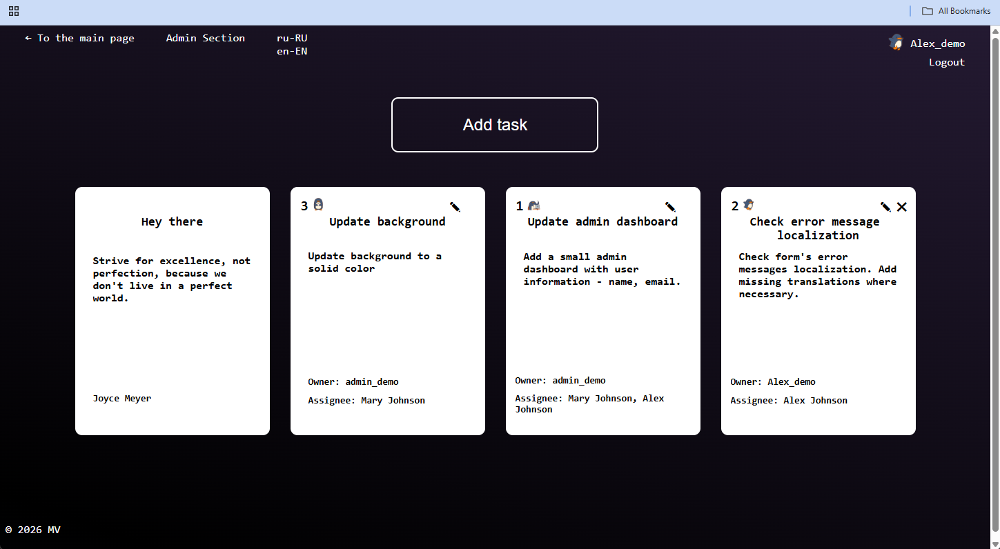
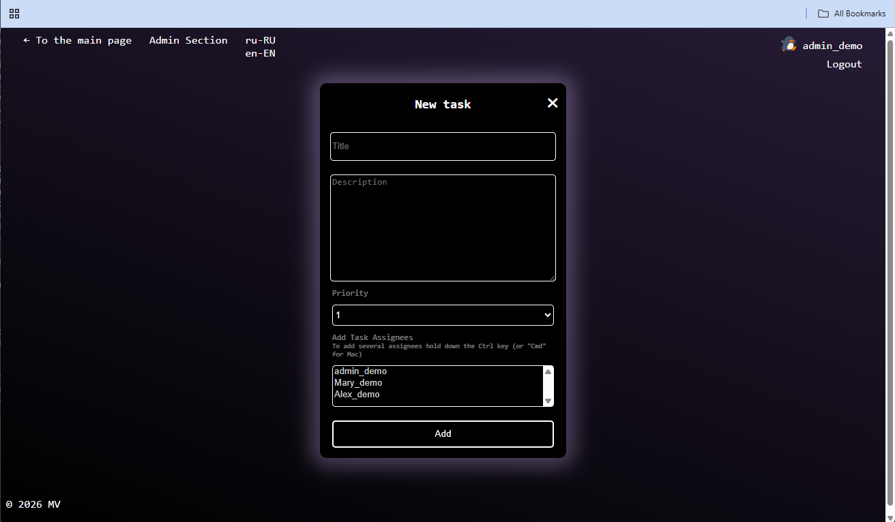

# TaskWebApp

## Overview

TaskWebApp is an ASP.NET Core MVC demo application built to showcase .NET development skills.

The application allows authenticated users to create task cards, add descriptions, set task priority, and assign tasks to other users. All users can view task cards, while only the creator of a task can edit or delete their own card.

The application also includes:

- a **news feed** on the home page with live updates using SignalR
- **localization** with English and Russian language support
- an **admin section** available only to users with the administrator role

---

## Features

- User authentication with cookie-based login
- Role-based authorization
- Task card creation and management
- Task ownership rules:
  - all authorized users can view tasks
  - only the creator can edit or delete their own tasks
- Real-time news updates using SignalR
- Admin-only section
- End-to-end UI tests with NUnit and Selenium

---

## Tech Stack

- **ASP.NET Core MVC** for the web application structure
- **.NET 8** 
- **Entity Framework Core 8** for data access
- **SQL Server** (development DB)
- **SignalR** for live updates on the news feed
- **HTML, CSS, JavaScript, jQuery**
- **NUnit**
- **Selenium WebDriver**

---

## Future improvements

- Add a small admin dashboard with user information
- Refine the UI and overall user experience
- Add safer demo-access controls for authenticated functionality to prevent public abuse
- Deploy a public read-only demo version of the application

## Screenshots

### Home Page


### Login Page



### Tasks Dashboard



### Add Task Page


## Running the Project Locally

### Prerequisites

- .NET 8 SDK
- SQL Server LocalDB (or another SQL Server instance)
- Visual Studio 2022 or later

### Setup

1. Clone the repository:
```bash
git clone https://github.com/Geomap987/TaskWebApp.git
```
2. Open the solution file TaskWebApp.sln in Visual Studio/Rider
2. Restore dependencies by running in terminal: 
```bash
dotnet restore
```
3. Apply database migrations by running in terminal (while in the folder containing .cproj file):
```bash
dotnet tool install --global dotnet-ef
dotnet ef database update
```
4. To seed demo users:
- admin_demo (user with admin role), 
- Mary_demo, 
- Alex_demo,
 and set user passwords using user secrets run in terminal:
 ```bash
dotnet user-secrets set "DemoSeed:Enabled" "true"
dotnet user-secrets set "DemoSeed:Users:admin_demo:Password" "SET_THE_PASSWORD_HERE"
dotnet user-secrets set "DemoSeed:Users:Mary_demo:Password" "SET_THE_PASSWORD_HERE"
dotnet user-secrets set "DemoSeed:Users:Alex_demo:Password" "SET_THE_PASSWORD_HERE"
```
5. Run the application

### How to run E2E Test

1. In the TaskWebApp\TaskWebApp.E2ETests\TaskTrackerTest.cs file set your admin_demo user password
```csharp
public const string ADMIN_PASSWORD = "YOUR_PASSWORD_HERE"; 
```
Save the file.
2. While TaskWebApp.sln is running start tests from the terminal:
```bash
dotnet test
```